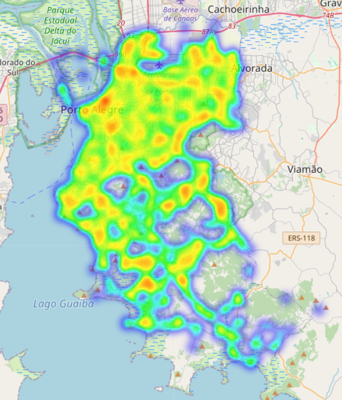
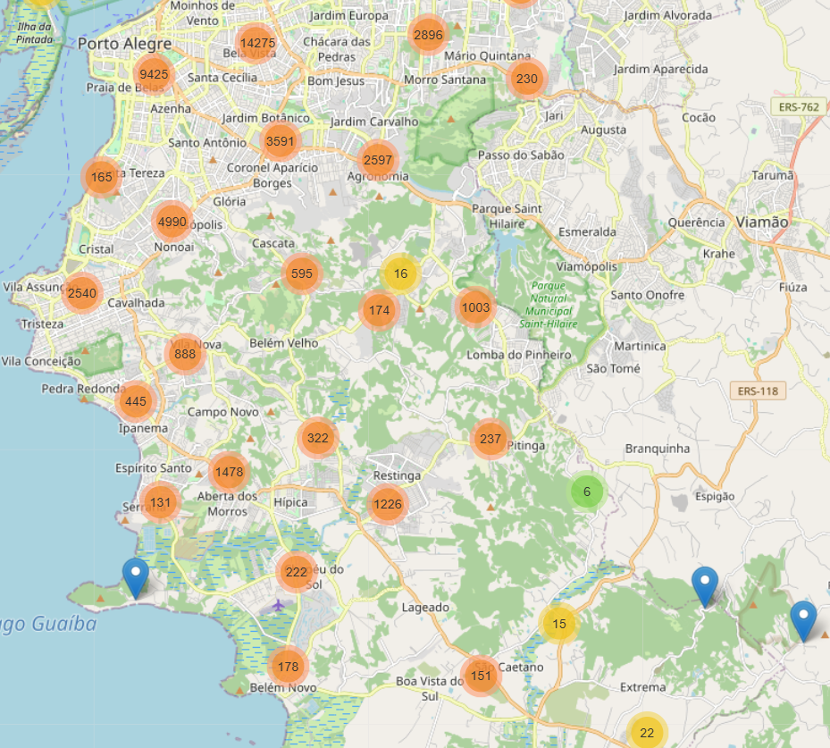

# Traffic Accidents Analysis – Porto Alegre

## Project Overview
This project explores traffic accident data from the municipality of **Porto Alegre**, aiming to understand accident patterns through **exploratory data analysis (EDA)**, **data cleaning**, and **spatial and temporal visualizations**.

The analysis focuses on identifying trends over time and spatial concentrations of accidents to support future investigations related to traffic safety and urban planning.

---

## Dataset Description
The dataset contains records of traffic accidents, including:
- Date and time of the accident
- Geographic coordinates (latitude and longitude)
- Regional and categorical attributes related to accident classification

---

## Exploratory Data Analysis (EDA) and Data Cleaning

### Initial Exploration
Basic exploratory methods were applied to understand the dataset structure and quality:
- `head()`, `describe()`, and `dtypes`
- Missing value inspection

### Data Type Corrections
Some columns required type adjustments to enable reliable analysis:
- The `data` column was converted from object to `datetime`
- The `hora` column was converted from string format (`HH:MM`) to an integer hour representation (0–23)

### Handling Missing Values
Missing data was treated based on each variable’s role:
- Rows with missing `latitude` or `longitude` were removed, as spatial analysis requires valid coordinates
- Missing values in categorical columns (`log1`, `log2`, `regiao`, `consorcio`, `predial1`) were filled with `"Unknown"`
- Missing values in the `hora` column were labeled as `-1` to represent an unknown hour

After these steps, the dataset was cleaned, standardized, and prepared for analysis.

---

## Spatial Analysis

### Heatmap Visualization
An interactive heatmap was created using **Folium** to visualize accident density across Porto Alegre.  
This approach highlights areas with a higher concentration of accidents.

> Note: Heatmap generation required the removal of missing geographic coordinates, as Folium does not support `NaN` values.

---

### Marker Clustering
To improve interpretability, a **MarkerCluster** visualization was implemented:
- Groups nearby accident locations
- Dynamically expands clusters as users zoom in
- Prevents map overcrowding

This visualization helps identify high-density zones while maintaining map clarity.

---

## Temporal Analysis

### Accidents per Year
A bar chart was created to visualize the total number of traffic accidents per year:
- Each bar represents one year
- Value labels display exact accident counts
- The chart enables easy comparison across years

This visualization provides a high-level overview of accident trends over time.

---

## Conclusion

This exploratory data analysis provided an initial understanding of traffic accident patterns in Porto Alegre. After resolving data quality issues, the dataset became suitable for both temporal and spatial analysis.

Key insights include:
- Traffic accidents are spatially concentrated, indicating potential high-risk areas
- Accident counts vary across years, rather than remaining stable
- Temporal variation suggests that external factors such as traffic volume, policy changes, or reporting practices may influence accident frequency

Overall, this analysis establishes a strong foundation for deeper investigation.

---

## Next Steps
Possible extensions of this project include:
- Identifying and ranking accident hotspots
- Analyzing accidents by time of day or day of week
- Exploring relationships between accidents and road, weather, or regional characteristics
- Applying predictive or clustering models for deeper insights

---

## Tools and Libraries
- Python
- Pandas
- Matplotlib
- Seaborn
- Folium

---

## Author
**Maykon Jonattan**  
Aspiring Data Analyst
